# 🛠️플러터로 웹툰 앱 만들기

## 시작하기 전에...

- **Flutter**는 **Dart**를 사용하므로 [다트 문법 다시보기](https://github.com/ezurno/dart-learn)
- ⚙️INSTALLATION 참고
- flutter doctor 로 파일 생성시 문제가 없는지 issue check
- powershell 에서 flutter create projectName
- projectName 은 [Naming 규칙](https://dart.dev/tools/pub/pubspec#name)을 따라야 함
- Vscode를 바로 실행하면 간혹 AVD가 켜지지 않으므로 powershell 에서 `code .` 를 사용해야 함

<br/>
<hr/>

###### 20230320

> ## App-bar 생성

<br/>

<br/>
<br/>

- 메인화면에 오늘의 웹툰을 리스트로 뽑아주는 **App-bar** 를 만들어 줌
- **Andorid** 에서는 기본설정으로 가운데지정이 안되어 있기 때문에 따로 지정해주어야 함
- `appbar.AppBar(centerTitle: true)`

<br/>

```Dart
appBar: AppBar(
        backgroundColor: Colors.white,
        foregroundColor: Colors.green,
        elevation: 2,
        centerTitle: true,

        // 중략

```

<br/>

> ## API 연결하기

<br/>


<br/>
<br/>

- **API** 연결하기에 앞서 **flutter**에서는 `url` 값을 가져오기 위해선 패키지를 하나 설치해야 함
- **pub.dev** 에서 **http** 검색 및 설치

<br/>

- 설치 방법은 여러가지가 있으며, 그중에서도 `pubspec.yaml` 의 의존성을 따로 설정해 설치해 줄 것임
- `pubspec.yaml` 내 `dependency` > `http: ^0.13.5` 입력

<br/>

```yaml
dependencies:
  flutter:
    sdk: flutter

  http: ^0.13.5
```

<br/>

<br/>
<br/>

- 이외에도 `pubspec.yaml` 에서는 **font**, **img** 등 여러 파일을 설치 할 수 있음

<br/>
<br/>

<br/>
<br/>

- 오른쪽 상단의 `get package` 버튼을 눌러 설치
- 설치가 완료되었으면 **API**를 관리하는 `dart` 파일 생성

<br/>
<br/>

- **API** 를 관리하는 파일 내에서 **API** `get` 방식으로 값을 가져오기 위해 함수 를 사용

<br/>

<br/>
<br/>

- `Uri` 타입으로 값을 주어야한다고 경고표시가 남
- `get` 의 return type 은 **Future**, **Future**는 미래에 받을 값을 알려줌
- **API**통신 시 **delay**가 생길 수 있으므로 **Future** 사용, 응답이 완료 됐을 때 까지 대기함
- **React** 의 `async`, `await`와 비슷함
- 통신시 `statusCode`를 항상 확인하는 습관이 중요함

<br/>

```Dart
 void getTodaysToons() async {
    final url = Uri.parse("$baseUrl/$today");
    //Uri.parse 를 통해 url를 변경 해줌
    final response = await http.get(url);

    if (response.statusCode == 200) {
      print(response.body); // 만약 사애가 200으로 정상일 경우 console 에 내용 출력
      return;
    }
    throw Error(); // 그렇지 않을 시 error
  }
```

<br/>

<br/>
<br/>

- 정상적으로 data 값이 출력된다

<br/>

> ## 생성자를 활용하여 API 값을 새 인스턴스로

<br/>

- 이대로 가져온 `response.body` 값은 사실상 형태가 `json` 형식이 아닌 `string` 형태로 저장이 된다
- 따라서 `json` 형식으로 바꾸어 주어야 한다

<br/>

```Dart
    if (response.statusCode == 200) {
      final List<dynamic> webtoons = jsonDecode(response.body);
      // response.body로 가져오면 String 형식이 되므로 json형식으로 decoding 해준다
      // 새로운 List 타입의 공간으로 값을 할당
    }
```

<br/>

- 각 `Object` 값을 `WebtoonModel`로 **reform** 함

<br/>

```Dart
class WebtoonModel {
  final String title, thumb, id;

  WebtoonModel.fromJson(Map<String, dynamic> json)
      // webtoonModel 의 fromJson 이라고 이름 붙인 생성자
      // Map<String, dynamic> 형식으로 이루어져 있으며 json이라고 이름 붙인다는 의미
      : title = json["title"],
        thumb = json["thumb"],
        id = json["id"];

  // 각 값을 넣고 초기화 시켜주는 shotcut 구문
}
```

```Dart
for (var webtoon in webtoons) {
        final toonInfo = WebtoonModel.fromJson(webtoon);
        // print(toonInfo)
}
```

<br/>


<br/>
<br/>

- 값이 제대로 변환되었다.
- 이제 변환된 값을 사용할 수 있도록 최종적으로 `webtoonsInstance` 에 넣어서 관리해준다.

<br/>

```Dart

  Future<List<WebtoonModel>> getTodaysToons() async {
    List<WebtoonModel> webtoonInstance = [];

    final url = Uri.parse("$baseUrl/$today");
    final response = await http.get(url);


    if (response.statusCode == 200) {
      final List<dynamic> webtoons = jsonDecode(response.body);


      for (var webtoon in webtoons) {
        final toonInfo = WebtoonModel.fromJson(webtoon);
        webtoonInstance.add(toonInfo); // 값을 넣어줌
      }

      return webtoonInstance;
    }
    throw Error(); // 그렇지 않을 시 error
  }
```

<br/>

###### 20230323

> ## 외부 Widget에서 API 값 사용하기

<br/>

- **API** 값을 가져오는 **widget**의 변수와 비동기함수를 `static`으로 우선 변환 시켜준다
- tatic 을 거는 이유는 ApiService 마다 값이 공유가 되어야하는데 걸지 않았을 경우, 값을 할당할 때 따로 놀기 때문
- 사용할 **Widget**의 `Stateless` 를 `Stateful`로 수정해주고 **API-instance**값을 저장할 새 `state`를 만들어준다.

<br/>

```Dart
class _HomeScreenState extends State<HomeScreen> {
  List<WebtoonModel> webtoons = [];
  bool isLoading = true;
  void waitForWebToons() async {
    webtoons = await ApiService.getTodaysToons();
    // API server 에서 받아온 webtoonInstance 를 가져옴
    isLoading = false;
    setState(() {});
  }
}
```

<br/>

<br/>
<br/>

- `print()`를 사용해 디버그콘솔로 확인해봄
- `restart` 시 빈 배열에 loading 값도 **true**로 나오다가 비동기처리 된 API 값이 완전히 받아왔을 시 정상적으로 값을 가져오는 모습

<br/>
<br/>

> ## FutureBuilder 를 사용해 API 간단하게 연결하기

<br/>

- 간혹 `state`를 사용할 수 없는 **widget**이 있기도 하며 더 간단하게 `api` 연결을 할 수 있음
- `FutureBuilder` 를 사용하면 `statelessWidget` 에서도 `api` 연결 가능
- `Scaffold.body` 에 넣어서 사용

<br/>

```Dart
class HomeScreen extends StatelessWidget {
  HomeScreen({super.key});
  Future<List<WebtoonModel>> webtoons = ApiService.getTodaysToons();
  //  webtoons 가 곧 가져올 API 값을 할당할 것이기 때문에 Future 로 지정
}
 // 중략

return Scaffold(
  body: FutureBuilder(
    future: webtoons,
    // FutureBuilder 가 webtoons 를 기다리게 해줌
    builder: (context, snapshot) {
      // shotcut으로 받을 수 있음
      // 요구하는 함수는 context와 snapshot을 받는데, snapshot은 future 의 상태를 나타냄
      if(snapshot.hasData) {
        // future 의 값이 존재 할 시,
        return const Text("It has data!");
      } else return const Text("Loading . . .");
    }
  )

)
```

<br/>

<br/>
<br/>

- 데이터 값을 받아오기 전엔 **Loading...**, 정상적으로 데이터를 로드 한 후엔 **It has data!** 를 출력하는 모습

<br/>
<br/>

> ## CircularProgressIndicator 로 로딩창 만들기

<br/>

<br/>
<br/>

- `CircularProgressIndicator-widget` 은 원형으로 로딩 바가 돌아가는 애니메이션
- **is Loading...** 구문을 대체 해줌

<br/>
<br/>

> ## ListView-widget

<br/>

## ListView

<br/>

- `ListView-widget` 은 많은 양의 데이터를 보여줄 때 적합하며 여러 항목을 나열하는데 최적화 됨
- 자동으로 scroll-view 도 가지고 있음

<br/>

```Dart
ListView(
              // 많은 양의 데이터를 보여줄 때 적합함 widget, 여러 항목을 나열하는데 최적화 됨
              // 자동으로 scroll-view 도 가지고 있음
              children: [
                for (var webtoon in snapshot.data!)
                  Text(webtoon.title) // collection for
              ],
            );
```

<br/>

<br/>
<br/>

## ListView.builder

<br/>

- `ListView.builder-widget` 은 `ListView`의 상위호환
- user 가 해당 항목을 보고있지 않는다면 항목을 메모리에서 삭제해버림

<br/>

```Dart
ListView.builder(
              //ListView.builder 는 ListView 의 상위 버전
              // user 가 해당 항목을 보고있지 않는다면 항목을 메모리에서 삭제해버림
              scrollDirection: Axis.horizontal, // 축도 변경 가능
              itemCount: snapshot.data!.length,

              itemBuilder: (context, index) {
                var webtoon = snapshot.data![index];
                return Text(webtoon.title);
              }, // 필수, list 형식으로 값을 사용하며 index를 사용해 항목을 조절
            );
```

<br/>

<br/>
<br/>

## ListView.seperated

<br/>

- `ListView-seperated`는 항목 사이에 무언가를 추가할 때 사용

<br/>

```Dart
ListView.separated(
              //ListView.separated 는 builder 가 만든 item 사이에 무언가를 넣을 시 사용
              scrollDirection: Axis.horizontal,
              itemCount: snapshot.data!.length,

              itemBuilder: (context, index) {
                var webtoon = snapshot.data![index];
                return Text(webtoon.title);
              },

              separatorBuilder: (context, index) {
                // 필수, 사이 간격에 넣을 시 사용
                return const SizedBox(
                  width: 20,
                );
              },
            );
```

<br/>

<br/>
<br/>

<br/>

###### 20230324

> ## 웹툰의 섬네일 이미지 활용

<br/>

<br/>

- 우선적으로 함수를 하나 만들어 기존에 있던 길었던 widget을 정리

<br/>

<br/>

- 하지만 **Error** 가 발생함
- 해당 에러는 `ListView` widget 의 `height` 값을 정해주지 않아 생긴 **Error**
- `Expanded`를 사용해 해결

```Dart
Expanded(
            child: makeList(snapshot),
            //ListView 가 높이가 무한정으로 커질 수 있기 떄문에 error 가 나는데, Expanded로 잡아주어 해결
        )
```

<br/>

## Image.network 를 사용해 url-image 가져오기

- `Image.network` 는 `image-url`을 이용해 이미지를 가져올 수 있음
- `403 error` 가 나온다면 브라우저가 해당 url 을 가져올 때 브라우저의 값이 아니면 차단하기 때문
- `headers` 에 `User-Agent` 값을 넣어주면 해결 ([참고](https://gist.github.com/preinpost/941efd33dff90d9f8c7a208da40c18a9))

<br/>

```Dart
Image.network(
                webtoon.thumb,
                headers: const {
                  "User-Agent":
                      'Mozilla/5.0 (Windows NT 10.0; Win64; x64) AppleWebKit/537.36 (KHTML, like Gecko) Chrome/111.0.0.0 Safari/537.36',
                },
)
```

<br/>
<p>


<p/>
<br/>

- 정상적으로 이미지를 불러온 모습
- 이미지가 너무 크기 때문에 `Container`로 감싸준 후 `decoration` 을 활용해 사이즈를 조절해줌
- `border-radius`를 주기 위해 `clipBehavior` 를 활용해 넘치는 이미지 부분을 관리 해줌

<br/>

## 그림자 적용하기

- 이미지에 그림자를 적용하기 위해 `BoxShadow` widget을 활용

<br/>

```Dart
boxShadow: [
              BoxShadow(
                color: Colors.black.withOpacity(0.5),
                offset: const Offset(10, 10),
                blurRadius: 15,
              ), // BoxShadow widget은 Box의 그림자를 만들어주는 Widget
            ],

```

<br/>
<p>


<p/>
<br/>

- 그림자가 잘 적용된 모습.
- 추가로 `ListView` 에 `padding` 속성을 부여해 칸을 띄워주었다.

<br/>

###### 20230325

> ## 각 웹툰의 상세정보 만들기

<br/>

## GestureDetector 로 이벤트 동작 생성하기

<br/>

- `GestureDetactor` 는 **동작 이벤트**를 감지하는 widget으로써 클릭 이벤트 등을 추가 해줄 수 있다
- `onTap` 은 클릭이벤트와 유사

<br/>

```Dart
 GestureDetector(
      // 동작 이벤트를 감지하는 widget
      onTap: () {
        // 클릭 시 event 생성
      }
 )
```

<br/>

## Navigator 로 화면 전환하기

<br/>

- `Navigator` 는 해당 `route` 의 widget을 화면전환 할수 있게 함
- `Navigator.push()` 의 args는 `context` 와 `route` 를 사용함
- route를 `PageRouteBuilder` 를 사용 [[참고]]( https://docs.flutter.dev/cookbook/animation/page-route-animation )

<br/>

```Dart
estureDetector(
      // 동작 이벤트를 감지하는 widget
      onTap: () {
        Navigator.push(
          context,
          PageRouteBuilder(
            // PageRouteBuilder 를 이용해 화면전환 animation 을 구현
            // https://docs.flutter.dev/cookbook/animation/page-route-animation [문서참고]
            transitionsBuilder:
                (context, animation, secondaryAnimation, child) {
              var begin = const Offset(1.0, 0.0);
              var end = Offset.zero;
              var curve = Curves.ease;
              var tween =
                  Tween(begin: begin, end: end).chain(CurveTween(curve: curve));
              return SlideTransition(
                // Slider 애니메이션을 주는 widget.
                position: animation.drive(tween),
                child: child,
              );
                }
          )
        )
      }
)
```

<br/>
<p>


<p/>
<br/>

- 클릭 시 화면전환이 이루어지며 상단 탭의 이름이 **webtoon** 의 `title` 명으로 변경 된 모습

<br/>

###### 20230326

> ## Hero-widget을 사용해 화면전환 Animation 만들기

<br/>

- `Hero` widget은 `react-animation.layoutId`를 사용해 애니메이션을 주는 효과와 비슷함
- 사용하려면 해당 효과를 줄 **widget** 에 `Hero` widget 으로 감싼 후 tag를 부여
- 화면전환 시 보여질 widget에도 동일한 tag를 부여하면 해당 **widget**이 전환되지 않고 이동하는 애니메이션을 줌

<br/>

```Dart
  Hero(
    // 이동할 widget. **webtoons_widget.dart
            // Hero-widget 은 react-animation 의 layoutid 를 사용하는 것과 유사함
            tag: id,
            // tag 는 해당 widget 의 id를 부여하는 값
            child: Container(
              width: 250,
              clipBehavior: Clip.hardEdge,
              decoration: BoxDecoration(
                // 중략
```

```Dart
  Row(
    // 이동 될 widget **detail_screen.dart
            mainAxisAlignment: MainAxisAlignment.center,
            children: [
              Hero(
                tag: id,
                // 동일한 tag 값을 주어야 한다.
                child: Container(
                  width: 250,
                  clipBehavior: Clip.hardEdge,
```

<br/>
<br/>

###### 20230420

> ## API 통신을 위한 Model 생성

<br/>

- **api data** 를 받아올 떄 값을 일시적으로 담을 `model` 을 생성
- **Future** 로 `model` 을 받을 함수 생성
- url 을 url + id 값으로 접근하기 위해 Uri.parse로 수정 해주며 해당 url 값을 response 로 받음
- statusCode 가 200 일 시 **정상적으로 값을 받아온 것** 이므로 해당하는 json 을 decode 해서 model 에 전달 함

<br/>

```Dart
  static Future<WebtoonDetailModel> getToonById(String id) async {
    final url = Uri.parse("$baseUrl/$id");
    // 가져올 id 값의 데이터를 받아와야 하므로
    final response = await http.get(url); // 응답 값을 가져옴
    if (response.statusCode == 200) {
      // 응답 값이 200 이면 정상적으로 값을 가져온 것이므로
      final webtoon = jsonDecode(response.body); // 받아온 json 의 값을 decode 해서 풀어줌

      return WebtoonDetailModel.fromJson(
          webtoon); // 그 값을 새로운 WebtoonDetailModel 로 재 생성
    }
    throw Error(); // 그렇지 않을 시 에러
  }

  static Future<List<WebtoonEpisodeModel>> getLatestEpisodesById(
      String id) async {
    // 최근 episode 정보를 가져오는 함수 상단의 getToonById 와 유사

    List<WebtoonEpisodeModel> episodesInstances = [];

    final url = Uri.parse("$baseUrl/$id/episodes");
    final response = await http.get(url); // 응답 값을 가져옴
    if (response.statusCode == 200) {
      final episodes = jsonDecode(response.body);

      for (var episode in episodes) {
        // episodes 배열 내 값을 일일히 WebtoonEpisodeModel 로 전달
        episodesInstances.add(WebtoonEpisodeModel.fromJson(episode));
        //episodesInstances 배열 내에 add 함
      }

      return episodesInstances;
    }
    throw Error();
  }
```

<br/>
<br/>

###### 20230423

> ## API 통신으로 받아온 data 사용하기

<br/>

- `ApiService` 에서 구현한 get~~Id 함수를 가져와서 사용 함
- 사용하기 위해서는 get~~Id 함수가 args로 id를 갖기 때문에 id 를 넘겨주어야 함
- 하지만 `statelessWidget` 은 넘겨줄 수가 없음 => **각 클래스별로 개별 id가 아니기 때문**
- 따라서 `statefulWidget`으로 전환 한 후 `late` 를 걸어 `initState()` 함수를 호출 해 id 를 넘겨주어야 함
- `WebtoonEpisodeModel` 과 `WebtoonDetailModel` 로 받아온 data 를 사용 하기 위해선 **Stateful-Widget** 으로 바꾸어야함

<br/>
<br/>

```Dart
  @override
  State<DetailScreen> createState() => _DetailScreenState();
}
class _DetailScreenState extends State<DetailScreen> {
  late Future<WebtoonDetailModel> webtoon;
  // widget.id 의 widget 은 해당하는 별도의 widget 이며 각 해당하는 웹툰을 의미함
  late Future<List<WebtoonEpisodeModel>> episodes;
  @override
  void initState() {
    super.initState();
    webtoon = ApiService.getToonById(widget.id);
    // 바로 참조가 안되므로 initState 값으로 넣어주어야 함
    episodes = ApiService.getLatestEpisodesById(widget.id);
  }
```

<br/>

```Dart
/*
  앞서 연결한 detail-data를 가져와서 사용하기 위해 FutureBuilder 를 사용
*/

FutureBuilder(
            future: webtoon,
            // webtoon 과 episodes 를 가져오기 위해 사용
            builder: (context, snapshot) {
              if (snapshot.hasData) {
                return Padding(
                  padding: const EdgeInsets.symmetric(
                    horizontal: 50,
                  ),
                  child: Column(... // 중략),
                    ],
                  ),
                );
              } else {
                return const Text("...");
              }
            },
```

<br/>
<br/>
<p>
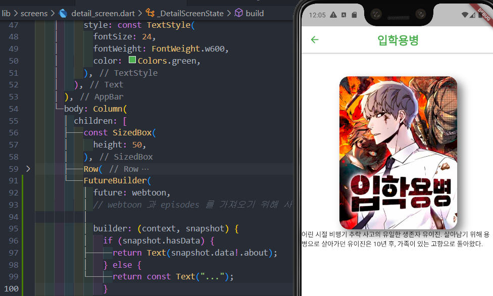

</p>

<br/>
<br/>

###### 20230424

> ## API 통신으로 받아온 episode 사용하기

<br/>

- 상단의 **data 받아오기**와 동일
- `episode` 목록을 List 형식으로 뿌려줌
- 데이터의 갯수를 알고 있으면 `Column()` 으로 생성하는 것이 편하지만 되도록이면 `ListView()` 를 사용하길 권장

<br/>
<p>
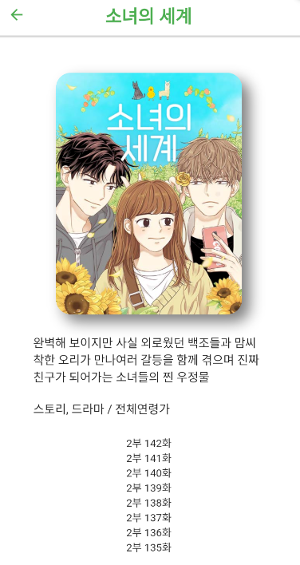
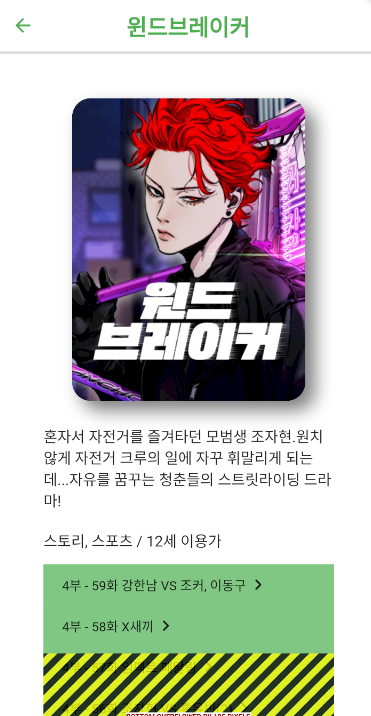
<p/>
<br/>

제대로 `episode.title` 을 출력하는 모습 (좌측)

하지만 떄떄로 webtoon 의 부연설명이 길수록 하단의 창을 넘어 생성되어 error 발생 (우측)

<br/>

```Dart
body: SingleChildScrollView(
        // 화면이 overflow 될 때 감싸주면 넘치는 화면을 제대로 구사 할 수 있음
        child: Padding(
          padding: const EdgeInsets.symmetric(horizontal: 50, vertical: 50),
          child: Column(
            children: [

              /* --  중략   --  */

```

<br/>
<p>
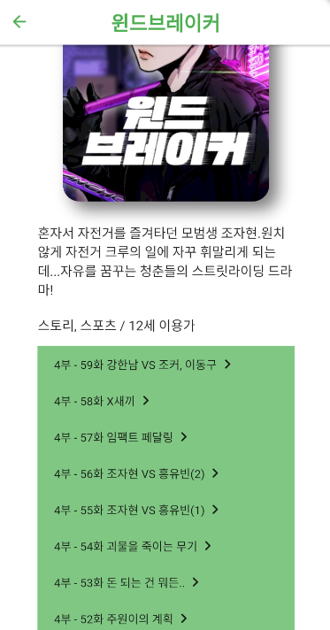
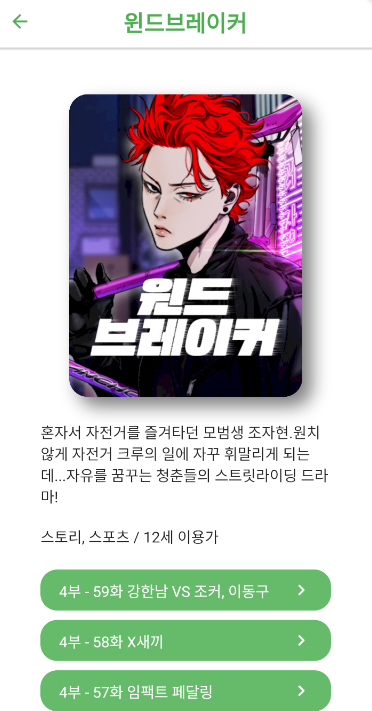
<p/>
<br/>

`SingleChildScrollView()` widget 을 사용하여 넘치는 화면을 정상적으로 출력 (좌측)

수정 후 **detail** 에 `style` 을 줌 (우측)

<br/>
<br/>

###### 20230425

> ## URL 연결하기

<br/>

- **Flutter** 에선 외부 `url` 을 연결 할 때 따로 라이브러리를 설치해야 함
- https://pub.dev/packages/url_launcher 에서 설치
- 설치후 파일을 조금 수정해 주어야 함

<br/>
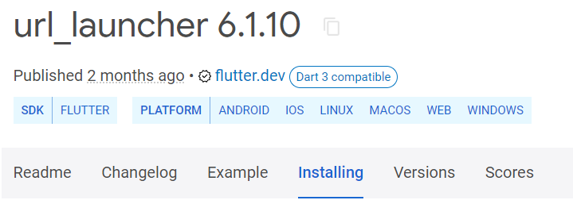
<br/>
<br/>

```Dart
// ios
<key>LSApplicationQueriesSchemes</key>
<array>
  <string>sms</string>
  <string>tel</string>
</array>

// android
<!-- Provide required visibility configuration for API level 30 and above -->
<queries>
  <!-- If your app checks for SMS support -->
  <intent>
    <action android:name="android.intent.action.VIEW" />
    <data android:scheme="sms" />
  </intent>
  <!-- If your app checks for call support -->
  <intent>
    <action android:name="android.intent.action.VIEW" />
    <data android:scheme="tel" />
  </intent>
</queries>
```

<p>
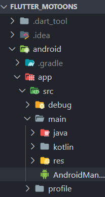
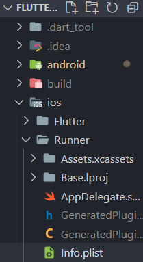
<p/>

좌측은 **android**, 우측은 **ios**

<br/>
<br/>

- 각 화로 넘어가는 버튼을 따로 refactoring 해줌
- refactoring 후 `url` 을 연결
- `GestureDetactor` 로 해당하는 버튼을 눌렀을 시 `onButtonTap()` 함수가 실행되게 함

<br/>

```Dart
  onButtonTap() async {
    final url = Uri.parse(
        "https://comic.naver.com/webtoon/detail?titleId=$webtoonId&no=${episode.id}");
    await launchUrl(url);
    // luanchUrl 은 Future 를 갖는 함수기 때문에 onButtonTap 에 async 를 걸어야 함
  }

  @override
  Widget build(BuildContext context) {
    return GestureDetector(
      // 사용자의 터치를 인식하기 위해 사용하는 Widget
      onTap: onButtonTap, // 해당하는 widget을 클릭 했을 시 onButtonTap 함수를 실행

      child: Container(

        /* --- 중 략  --- */
```

<br/>
<br/>
<p>
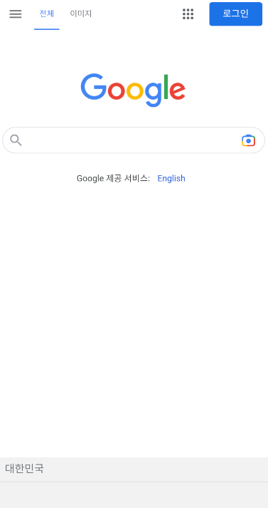
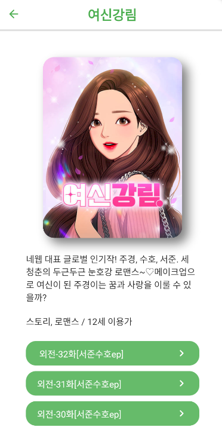

<p/>

**google** 으로 테스트 후 **webtoon** 에 적용

문제 없이 적용 되는 모습을 확인 할 수 있음

<br/>
<br/>

###### 20230426

> ## 좋아요 리스트 만들기

<br/>

- **좋아요 리스트 (liked-list)** 를 만들기 위해선 정보를 담는 라이브러리가 필요
- https://pub.dev/packages/shared_preferences/install

<br/>
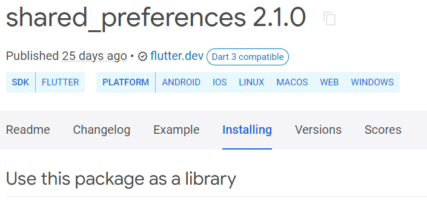
<br/>

- 핸드폰 내에 상태를 저장하기 위해 사용
- 저장소와 connection 을 만들어 사용
- [공식문서](https://pub.dev/packages/shared_preferences) 참고

<br/>

```Dart
// Write Data

// Obtain shared preferences.
final SharedPreferences prefs = await SharedPreferences.getInstance();

// Save an integer value to 'counter' key.
await prefs.setInt('counter', 10);
// Save an boolean value to 'repeat' key.
await prefs.setBool('repeat', true);
// Save an double value to 'decimal' key.
await prefs.setDouble('decimal', 1.5);
// Save an String value to 'action' key.
await prefs.setString('action', 'Start');
// Save an list of strings to 'items' key.
await prefs.setStringList('items', <String>['Earth', 'Moon', 'Sun']);

// Read Data

// Try reading data from the 'counter' key. If it doesn't exist, returns null.
final int? counter = prefs.getInt('counter');
// Try reading data from the 'repeat' key. If it doesn't exist, returns null.
final bool? repeat = prefs.getBool('repeat');
// Try reading data from the 'decimal' key. If it doesn't exist, returns null.
final double? decimal = prefs.getDouble('decimal');
// Try reading data from the 'action' key. If it doesn't exist, returns null.
final String? action = prefs.getString('action');
// Try reading data from the 'items' key. If it doesn't exist, returns null.
final List<String>? items = prefs.getStringList('items');

// Delete Data

// Remove data for the 'counter' key.
await prefs.remove('counter');
```

<br/>
<br/>

```Dart
  // Shared Preferrences 를 활용

  late SharedPreferences prefs;
  // shared preferences 를 사용한 변수 설정
  bool isLiked = false; // 좋아요를 눌렀는지 여부, 초깃값은 false

  Future initPrefs() async {
    prefs = await SharedPreferences.getInstance();
    final likedToons = prefs.getStringList("likedToons");
    // 좋아요를 누른 웹툰의 목록을 불러옴

    if (likedToons != null) {
      if (likedToons.contains(widget.id) == true) {
        //likedToons 리스트에 해당 widget의 id 가 존재하는지
        setState(() {
          isLiked = true;
        });
      }
    } else {
      // likedToons 가 없으면 (첫 실행이면) 좋아요 리스트를 생성
      await prefs.setStringList("likedToons", []); // 초깃값은 빈 배열
    }
  }

  onHeartTap() async {
    final likedToons = prefs.getStringList("likedToons");
    if (likedToons != null) {
      if (isLiked) {
        likedToons.remove(widget.id);
      } else {
        likedToons.add(widget.id);
      }

      await prefs.setStringList("likedToons", likedToons);

      setState(() {
        isLiked = !isLiked;
      });
    }
  }
```

<br/>
<p>
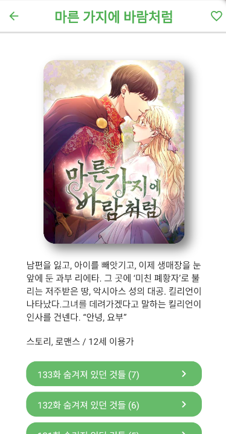

<p/>
<br/>

정상적으로 `icons()` 가 작동하는 모습
